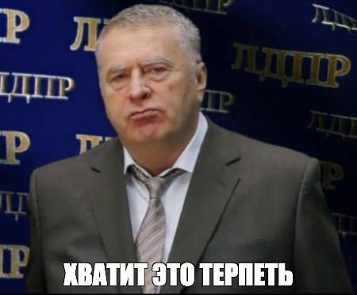

# My Little Pony: Shoot The Haters
Are you tired of My Little Pony Haters calling you autist and drawing space marines brutally murdering little ponies? No More!



## Installing
Game binaries will soon be available.
### Windows
First go to python.org website and download the latest version of python. Clone this repository. Then install pygame-ce. To do this open cmd.exe and run:
```
> python.exe -m ensurepip
> pip install pygame-ce
```
Then doubleclick the game.py file and it should work. If it doesn't try right-clicking the file and selecting "Open With IDLE" option. A window with game.py contents will open. Press F5 to run the game.
### Linux and macOS
Install python by following your distribution instructions. Clone this repository. Then install pygame-ce:
```bash
$ pip3 install pygame-ce --break-system-packages
$ python3 /path/to/game/game.py
```
or run the binary (only works on linux)
```bash
$ cd /path/to/game
$ chmod +x linux_x64
$ ./linux_x64
```
## Music
- "She is Young She is Beautiful She is Next" by Perturbator
- "Determination" by Toby Fox
- Painkiller OST - Bear Me The Light

## Instructions
Use mouse to aim, LMB click to shoot and [Z] key to activate the magic forcefield.
